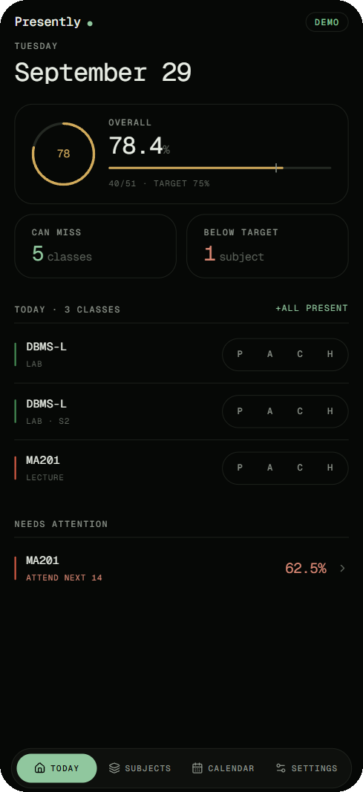
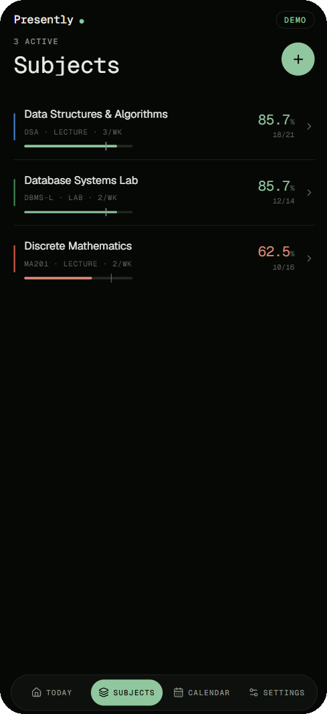
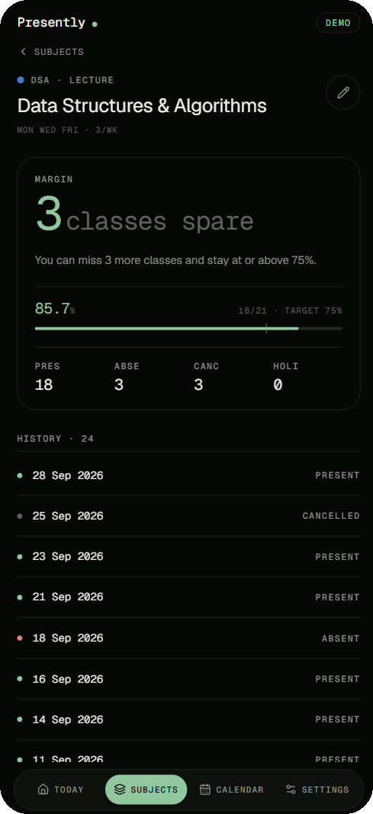
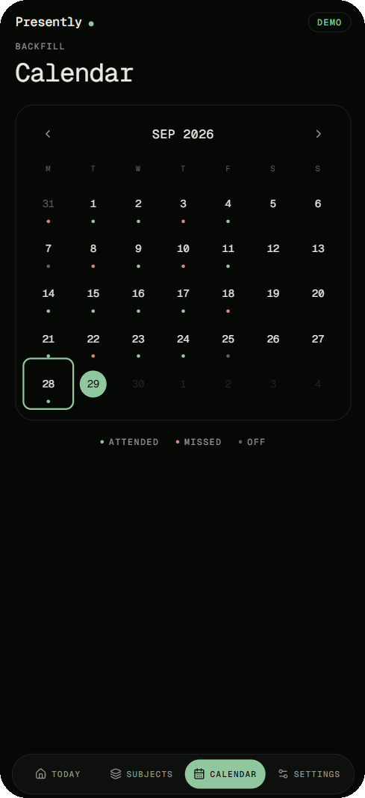
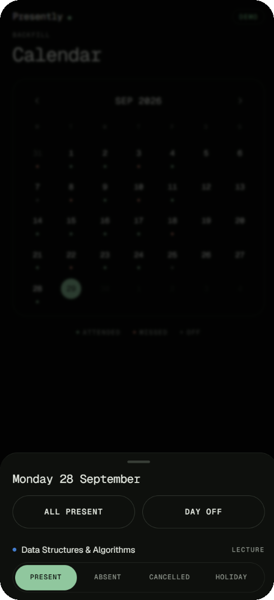

<div align="center">

# Presently

### Attendance, without the mental arithmetic.

Know exactly how many classes you can miss.<br />
And exactly how many you need.

**[Try it now](https://presently-beta.vercel.app)** · **[Run it yourself](#run-it-yourself)** · **[MIT licensed](LICENSE)**

<br />


&nbsp;&nbsp;

&nbsp;&nbsp;


</div>

<br />

## One number. The right one.

A percentage tells you where you have been. Presently tells you what to do next.

For every subject, it answers one of two questions:

> **You can miss 5 more classes** and stay on target.
>
> **Attend your next 14 classes** to get back on target.

No spreadsheet. No calculator. No guessing whether one more skip is the one that costs you.

<br />

## Three seconds a day.

Open it, and today's classes are already waiting. Tap **P**, **A**, **C** or **H** for Present, Absent, Cancelled or Holiday. Or mark the whole day at once with **All present**.

Your overall figure, your margin and the subjects that need attention update the moment you tap. Nothing to save, nothing to sync by hand.

<br />

## Missed a day? Fill it in.

<div align="center">

&nbsp;&nbsp;

</div>

<br />

The calendar shows your whole term at a glance: a dot under every day, coloured by what happened. Tap any past day to backfill it or correct a mistake. A holiday or a cancelled lecture is one tap. Neither is ever counted against you.

<br />

## Honest maths, not flattering maths.

- **Cancelled and Holiday never count.** They were never a chance to attend, so they never move your number.
- **Overall is weighted by class, not averaged by subject.** A subject that meets five times a week counts five times as much as one that meets once.
- **Exact to the class.** The formulas run in whole numbers, so being exactly on target never gets rounded into an off-by-one. That matters when the answer is "you can miss one more".

<br />

## Built for the way you actually use it.

**Offline first.** Mark attendance in a basement lecture hall with no signal. Every change is saved on your phone immediately and sent the moment you reconnect.

**Installs like an app.** Add it to your home screen. It opens full-screen, fast, with no browser chrome.

**Every screen size.** A dock on your phone, a sidebar on a tablet, a two-column dashboard on a laptop.

**Your targets, your timetable.** Set a target for each subject, with a separate timetable for lectures, labs and tutorials. Archive a subject when the term ends.

**Your data leaves with you.** Export everything to CSV whenever you like.

<br />

## Private by design.

Sign in with a magic link or a password. Every record is locked to your account at the database level by Postgres row-level security, not just hidden in the interface. Sign out on a shared computer and everything stored on that device is wiped with you.

No ads. No trackers. Nothing to sell.

<br />

## Free. Open. Yours.

Presently is open source under the [MIT License](LICENSE). Read every line, run your own copy, fork it for your college, or build something new on top of it. Just keep the licence notice.

Found a bug or have an idea? [Open an issue](https://github.com/nabrahma/Presently/issues). Pull requests are welcome too: see [Contributing](#contributing).

<br />

---

<br />

## Run it yourself

It takes about a minute. You need Node.js 22 or newer.

```bash
git clone https://github.com/nabrahma/Presently.git
cd Presently
npm install
npm run dev
```

Open the URL Vite prints, normally `http://localhost:5173`.

No account is needed. Without Supabase credentials, Presently runs in local-only mode: every feature works, and your data stays in the browser. That is also the fastest way to try a change.

### Add accounts and sync

Copy the example environment file and fill it in:

```bash
cp .env.example .env.local
```

```dotenv
VITE_SUPABASE_URL=https://your-project.supabase.co
VITE_SUPABASE_ANON_KEY=your-publishable-or-anon-key
```

Only the publishable/anon key belongs in the browser. Never commit a service-role key, database password, or personal access token.

Apply the schema to a fresh project:

```bash
npx supabase login
npx supabase link --project-ref <project-ref>
npx supabase db push --dry-run
npx supabase db push
```

Then, under **Authentication → URL Configuration**, set your deployed URL as both the Site URL and an allowed redirect URL, and add `http://localhost:5173` for local development. Magic links will not return to the app without this.

Migrations live in [supabase/migrations/](supabase/migrations/): the [initial schema](supabase/migrations/20260728_initial_schema.sql), then [constraints, triggers and indexes](supabase/migrations/20260729_harden_schema.sql).

### Deploy

Vercel deploys `main` automatically. For a manual release:

```bash
npx vercel --prod
```

Set `VITE_SUPABASE_URL` and `VITE_SUPABASE_ANON_KEY` for Production, Preview and Development.

## Contributing

Before opening a pull request, run the full check:

```bash
npm run check     # typecheck, tests, production build
```

You can also run each step on its own: `npm run typecheck`, `npm test`, `npm run build`.

The test suite covers:

- the attendance maths, including float boundaries and unreachable targets
- local dates across timezones and DST
- CSV escaping and formula injection
- timetable expansion when a schedule changes mid-term
- the sync path against a stand-in server, including expired tokens and tokens the database rejects as issued in the future
- full render passes over onboarding, the daily check-in, validation, persistence and dialog focus

Bug fixes should come with a test that fails without the fix. [DESIGN.md](DESIGN.md) explains the decisions behind the code and the trade-offs each one made.

## Under the hood

<details>
<summary><strong>The maths</strong></summary>

<br />

Only Present and Absent count. Cancelled and Holiday are deliberately excluded, because they were never a chance to attend.

```text
percentage = round(P / (P + A) × 100, 1)
bunkable   = floor((P × 100 − target × T) / target)        where T = P + A
comeback   = ceil((target × T − P × 100) / (100 − target))
```

Both formulas are evaluated in integer space rather than with a fractional target. In floating point, `0.75 × 20` is `14.999999999999998`, which turns an exactly-on-target record into an off-by-one. That is a real difference when the answer is "you can miss one more".

The implementation is in [src/lib/attendanceMath.ts](src/lib/attendanceMath.ts). It is tested against the worked examples, plus exhaustive sweeps that check each answer is both correct and minimal.

</details>

<details>
<summary><strong>Architecture</strong></summary>

<br />

| Layer | Choice |
| --- | --- |
| Application | React 19, TypeScript, Vite |
| Styling | Tailwind CSS v4, with the palette defined once as CSS custom properties |
| Type | Geist and Geist Mono, self-hosted |
| Motion | Motion, for transitions and the sliding dock indicator |
| Sheets | Vaul, for drag-to-dismiss drawers |
| Icons | Lucide |
| Auth and data | Supabase Auth, Postgres, Row Level Security |
| Offline and install | Workbox via vite-plugin-pwa |
| Hosting | Vercel |

```text
src/
  App.tsx              routes, access control, code splitting
  components/          shell, drawer, forms, gauges, data rows
  screens/             one file per route
  lib/
    attendanceMath.ts  pure, tested attendance calculations
    date.ts            local-calendar date keys
    schedule.ts        timetable expansion for a given day
    csv.ts             export and escaping
    store.tsx          state, sync, and the offline outbox
supabase/migrations/   versioned database schema
```

</details>

<details>
<summary><strong>How it is meant to feel</strong></summary>

<br />

Presently is installed and opened for a few seconds a day, so it is built as an app rather than a page. The viewport is pinned and exactly one region scrolls. The header and navigation are a layout route that mounts once, so moving between tabs slides an indicator instead of repainting the chrome. Safe areas are respected, and inputs are 16px so focusing one never zooms the layout.

The look is a single committed one: black canvas, one green accent, hairline outlines and mono numerals. There is no theme switcher, because there is no second theme to switch to.

</details>

<details>
<summary><strong>One app, three widths</strong></summary>

<br />

The phone layout is the baseline, and the wider layouts do not change it.

| Width | Layout |
| --- | --- |
| under 768px | Phone. Bottom dock, one column, drag-to-dismiss sheets. |
| 768px and up | The dock becomes a sidebar rail; subjects become a card grid. |
| 1024px and up | Today and each subject split into a working column plus a sticky summary rail. |

Two details depend on the *pointer* rather than the width, because that is what they are actually about:

- Text selection and tap highlights are suppressed only for touch, so a desktop can select and copy normally.
- The modal is a draggable bottom drawer on touch but a centred dialog with a mouse. A panel sliding up from the bottom edge of a wide display is a phone gesture with nothing to perform it.

Content stops widening well before the viewport does. A data row stretched across 1600px is unreadable, so the reading column caps out and centres.

</details>

<details>
<summary><strong>How syncing works</strong></summary>

<br />

Every write updates the screen, is queued, and goes to the server, in that order. The queue entry is written *before* the request leaves and removed only once the server confirms. So a request killed in flight, such as closing the app the instant after marking a class, still leaves a record of the intent. Anything left in the queue is replayed on reconnect, on resume, and at the start of the next load.

Both the data and the queue are written to storage synchronously as part of the change, not in an effect. The process can be frozen or killed before an effect runs, and that is exactly the moment when saving matters.

The queue holds *references*, not snapshots. A flush sends whatever the record looks like at that moment, so ten quick edits collapse into one request and a stale queue can never resurrect an old value. Unsent work is always replayed before a fetch. Anything still queued afterwards is laid back over the server's answer, so a refresh can never overwrite something that has not been sent yet.

Attendance rows are keyed on `(subject, date, session)`. Ids come from the database, and the local id is reconciled with the server's on the first successful write. That is what makes deleting a freshly created record reliable.

Access tokens expire while an installed app sits closed. The session is refreshed before any query on launch and on resume. When the server rejects a token as expired, the app refreshes it and retries once instead of reporting an error, because this failure is routine. The refresh is forced whenever the server says so, because the device's own clock may be slow enough to think the token is still valid.

The opposite also happens. PostgREST refuses a token whose issue time is ahead of the database's clock ("JWT issued at future"), and this usually happens right after a sign-in or refresh. Refreshing cannot help, because the new token would be newer still. Instead, those requests wait a few seconds and try again. Anything still refused stays queued and is retried in the background. A newly signed-in device with nothing cached stays on its loading screen until this clears. Otherwise it would show an empty account and send a returning user into setup.

</details>

<details>
<summary><strong>Privacy, in detail</strong></summary>

<br />

Every row is scoped to its owner by Row Level Security, and a database trigger rejects any attendance record filed against a subject you do not own. Presently keeps a local copy for offline use and clears it when you sign out, so the next person to open the app on a shared device sees nothing.

</details>

<br />

<div align="center">

Made for a little more certainty in a busy week.

**[Open Presently](https://presently-beta.vercel.app)**

</div>
